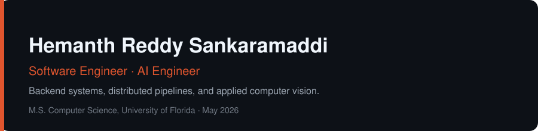

 

I build backend systems and ML pipelines end to end — Go microservices, Kafka
pipelines, and PyTorch computer-vision models. First-author on two peer-reviewed
CV/AI papers. Open to full-time SDE and ML engineering roles.

&nbsp;&nbsp;📧&nbsp; hemanth1729hr@gmail.com
&nbsp;&nbsp;·&nbsp;&nbsp; [LinkedIn](https://linkedin.com/in/hemanth-reddy-uf)
&nbsp;&nbsp;·&nbsp;&nbsp; [Google Scholar](https://scholar.google.com/citations?user=-j3k51wAAAAJ)

 

## Featured work

| Project | What it does | Stack |
| :--- | :--- | :--- |
| **[feed-engine](https://github.com/S-HEMANTH-REDDY/feed-engine)** | Distributed Reddit-style feed backend — ingest, ranking, fan-out with idempotent consumers. ~3.2k events/sec on a 3-broker cluster. | `Go` `Kafka` `Redis` `PostgreSQL` |
| **[quick-chat](https://github.com/S-HEMANTH-REDDY/Quick_Chat)** | Real-time chat service holding 5k concurrent connections at 8.5k msg/sec, p99 42 ms under load. | `Go` `WebSockets` `Redis` |
| **[llm-inference-runtime](https://github.com/S-HEMANTH-REDDY/llm-inference-runtime)** | LLM inference runtime with KV-cache management and continuous batching. | `Python` `PyTorch` `CUDA` |
| **[gpu-kernels-dl](https://github.com/S-HEMANTH-REDDY/gpu-kernels-dl)** | Custom GPU kernels — tiled matmul, row-wise softmax, parallel reduction — benchmarked against PyTorch. | `Triton` `CUDA C++` |

 

## Research

| Paper | Venue |
| :--- | :--- |
| **2D-to-3D Image Reconstruction in Agriculture** — methods, challenges, and AI-driven opportunities | *Sensors* 26(6), 2026 |
| **Time-Series Detection of Leaf Wetness** — CNN-LSTM vision system for strawberry farming | *J. Biosystems Engineering* 51(1), 2026 |

 

## Stack

`Go` &nbsp; `Python` &nbsp; `Java` &nbsp; `C++17` &nbsp;&nbsp;•&nbsp;&nbsp;
`Kafka` &nbsp; `Redis` &nbsp; `PostgreSQL` &nbsp; `gRPC` &nbsp; `FastAPI` &nbsp;&nbsp;•&nbsp;&nbsp;
`PyTorch` &nbsp; `OpenCV` &nbsp;&nbsp;•&nbsp;&nbsp;
`Docker` &nbsp; `AWS` &nbsp; `Linux`
